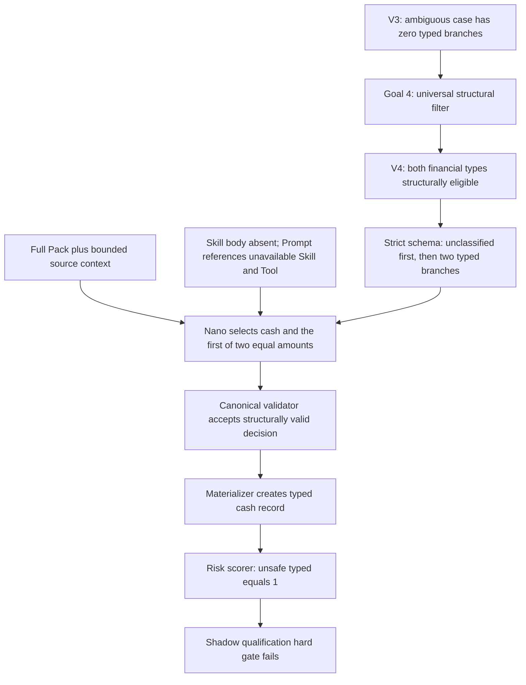

# Broker Reports Gate 2 — Nano Semantic Decision Evidence Audit

Date: 2026-07-26

Branch:
`codex/broker-reports-gate2-nano-semantic-evidence-audit`

Base revision:
`c49bba056d777b65baaa9969390e32454f4d0468`

Audit status:
`AUDIT_COMPLETE_ROOT_CAUSE_IDENTIFIED`

Runtime/product diff:
`ZERO`

Provider/customer calls created by this audit:
`0 / 0`

## 1. Executive outcome

The Goal 10 Nano failure is reconstructed at case level rather than inferred
from the Goal 10 aggregate report.

The exact V4 unsafe case is:
`syn_successor_v2_adjacent_equal`.

Its source context contains two equally valued amount candidates in one
bounded group and no unique amount association. The expected safe decision is
unclassified. The exact canonical provider decision was uniquely recovered
as a typed cash snapshot using the first amount candidate.

The primary systemic cause is a `scope defect`: the V3 safety boundary made
no typed branch representable for this case, while the V4 universal structural
scope exposed both active financial types. The direct event is a
`model semantic error`: Nano selected a cash type despite the complete Pack
and source context requiring ambiguity preservation.

Contributors:

- the managed Skill body was not transmitted to the model;
- the full Pack occupied 60.0–68.1% of each system message while case evidence
  occupied materially less;
- the strict schema made both typed branches valid for 10 of 12 cases.

Counterevidence:

- the Pack itself is semantically discriminating for the unsafe case;
- the Prompt explicitly prefers unclassified for ambiguity;
- the provider schema orders unclassified before typed;
- adapter, canonical validator, and materializer hashes all match;
- the unsafe benchmark expectation is independently product-grounded.

The exact Nano V4 attempt remains terminal and must not be rerun.

## 2. Evidence freeze and completeness

Pinned evidence:

| Boundary | V3 | V4 |
|---|---|---|
| execution revision | `eb5c6011066a524d97aad9ac3b07d2d969f3db87` | `2b451e7a1168165b1b1902c0c635b7b8bf246715` |
| exact model | `gpt-5.4-nano-2026-03-17` | same |
| receipt SHA-256 | `39f6a990d233926d7493056570730bdfa82f29df9a63d3f8f9d6cfa0e47dc641` | `c371262b9c9d6911b2bb250f441f1f158e5ed1259e93d2d3eefa6df5280f5426` |
| fixture canonical SHA-256 | `430bea21d0a36e993bc50184d971f36dfc75a1d2be12bcf5e43fba7436797d66` | same |
| cases | 12 | 12 |
| exact source contexts | reconstructed 12/12 | reconstructed 12/12 |
| exact model inputs | hash-matched 12/12 | hash-matched 12/12 |
| exact provider request forms | reconstructed 12/12 | reconstructed 12/12 |
| response formats | hash-matched 12/12 | hash-matched 12/12 |
| semantic provider decisions | uniquely recovered 12/12 | uniquely recovered 12/12 |
| validator/materializer path | hash-matched 12/12 | hash-matched 12/12 |
| raw response bytes | absent | absent |

Both source receipts explicitly state `raw_provider_output_included=false`.
The original transport envelope, JSON whitespace, and field order therefore
cannot be recovered.

This is not aggregate-only evidence. The complete semantic decision object for
every case was uniquely recovered by enumerating only schema-valid candidates,
running the real canonical validator and materializer, and requiring an exact
match to the recorded terminal artifact integrity hash.

The raw-byte gap prevents claims about response formatting or hidden provider
internals. It does not prevent analysis of the unsafe semantic decision.

Private local annex:

- evidence class: synthetic, non-customer;
- contains exact contexts, literals, opaque refs, full requests, expected
  decisions, recovered semantic decisions, and case receipts;
- stored under the ignored service-local evidence boundary;
- final private annex SHA-256:
  `d247368b9f496206a8337b3a825bd3c0159dfe83a1bb3f8e08a698fa692a6547`.

Repository-safe local projection SHA-256:
`e362c9413c5f0e8bb96837c60be39ec50c3671a2a3b9f3192429058f91a849d9`.

The terminal Goal 10 review head is
`6a68cd6ae890742363af1a5a644f35d25189f6c3`. Between the execution revision
and that head, the service/runtime source diff is zero; only the Goal 10
contract and safe report/receipt were added.

Additional V4 execution pins:

- provider profile: `openai_gpt`;
- provider route revision:
  `4232f7b089fec08326548bf4c70bb33fef0ce603c23d78d6110a9c9a8aec5929`;
- Semantic Pack integrity:
  `ab0b5aaaa4cd8133ab26d7dce8e501770c2d14f2c1bd2205cbad3fa2c6e0e7f8`;
- managed asset manifest:
  `b2d1d51f5894012871d9603b59b2a4dd597c9b83ac4d1b7714bf100468728b59`;
- managed Skill Git-blob SHA-256:
  `08a405c69b66aac2fcc1ed0be355a59e2df8e2b012fc7d107fdb2243208e02d5`;
- managed Prompt Git-blob SHA-256:
  `3f169c79a9bf6f0eb1b476853ed1ace50cca9b2f7fd2d2fe3394f2ab3f6d5a2e`;
- managed Pack Tool Git-blob SHA-256:
  `e7c1a49cc8988e88a16a0696c03ec7469c961a838fd22dd315257e50815ffaee`;
- model input:
  `broker_reports_gate2_financial_evidence_successor_model_input_v4`;
- provider projection:
  `broker_reports_gate2_financial_evidence_provider_projection_v3`;
- structural scope package:
  `broker_reports_gate2_deterministic_financial_scope_package_v2`;
- source-context policy:
  `gate2_financial_evidence_bounded_source_context_v2`;
- validator/materializer:
  `broker_reports_financial_evidence_validated_decision_v2` /
  `broker_reports_financial_evidence_materialization_v2`;
- risk scorer:
  `gate2_financial_domain_shadow_safety_gates_v1`;
- stage qualification Action:
  `broker_reports_gate2_economy_qualification_action`;
- stage Action content SHA-256 used for execution:
  `d75d96e1c4df1e448cec5e2dddf3f22f790f41d153dc2705e627667ff7e46e5d`;
- stage qualification-policy SHA-256:
  `4923be403dafb15145a02d36907ad840a7e71213e405455b9d43dbcee4b20a67`;
- qualification authorization SHA-256:
  `9560563de99ec80432937187fede47e39b65cca49ab8def6ed7e9f9d4859e651`.

## 3. Twelve case cards

### 3.1 `syn_successor_v2_unique_cash`

- Evidence: one bounded source group explicitly identifies a cash-class
  balance and supplies the required date, amount, currency, and scope.
- Expected / V4: typed cash / typed cash.
- Assessment: exact match; benchmark and input are grounded. The Pack
  separates this state from a generic printed metric.

### 3.2 `syn_successor_v2_unique_printed_total`

- Evidence: one bounded group explicitly identifies a source-printed metric
  with its required amount, label evidence, reporting dimension, and scope.
- Expected / V4: typed printed metric / typed printed metric.
- Assessment: exact match and a V3→V4 improvement. The full Pack helped
  distinguish the printed metric that V3 conservatively left unclassified.

### 3.3 `syn_successor_v2_multiple_compatible`

- Evidence: competing financial hypotheses and amounts are present without a
  unique authoritative association.
- Expected / V4: unclassified / unclassified.
- Assessment: exact safe match even though V4 exposes both typed branches.
  This case shows that broad scope does not force over-typing on every input.

### 3.4 `syn_successor_v2_no_registry_type`

- Evidence: source-stated financial content is present, but neither Pack type
  has positive source support.
- Expected / V4: unclassified / unclassified.
- Assessment: exact safe match. No type invention or data loss occurred.

### 3.5 `syn_successor_v2_missing_discriminator`

- Evidence: financial shape exists, but the positive semantic discriminator
  required by either Pack type is absent.
- Expected / V4: unclassified / unclassified.
- Assessment: exact safe match. The result follows the Pack's conservative
  ambiguity rule.

### 3.6 `syn_successor_v2_repeated_header`

- Evidence: layout-only header content contains no source-stated financial
  value.
- Expected / V4: no financial input / unclassified.
- Assessment: quality mismatch, not unsafe typing. The product expectation is
  valid, but the model-facing context labels the row generically as a fact
  candidate and omits an authoritative layout/header role. This case is
  model-input under-grounded.

### 3.7 `syn_successor_v2_detail_vs_subtotal`

- Evidence: detail and subtotal semantics are not uniquely associated to one
  safe canonical type.
- Expected / V4: unclassified / unclassified.
- Assessment: exact safe match; no invented aggregate.

### 3.8 `syn_successor_v2_adjacent_equal`

- Evidence: two equal amount candidates occur in one bounded source group.
  The group has no unique association selecting one amount as the cash state.
- Expected / V4: unclassified / typed cash.
- Recovered decision: cash snapshot using the first amount candidate; the
  second amount remains outside the typed interpretation.
- Assessment: unsafe typed semantic error. The Pack says a matching literal,
  adjacency, or cash-like label is insufficient when association is unclear.
  V4 nevertheless made both financial types schema-valid.

### 3.9 `syn_successor_v2_adjacent_fx`

- Evidence: adjacent monetary/FX candidates do not provide a unique safe
  semantic association.
- Expected / V4: unclassified / unclassified.
- Assessment: exact safe match despite the same broad two-type scope.

### 3.10 `syn_successor_v2_optional_missing`

- Evidence: positive cash meaning and all required roles are explicit; only
  optional dimensions are absent.
- Expected / V4: typed cash / unclassified.
- Assessment: safe under-typing. It preserves all values but lowers typed
  recall. Broad exposure of the competing printed-metric type plus a strongly
  conservative Prompt/Pack is a plausible contributor.

### 3.11 `syn_successor_v2_forbidden_neighbour`

- Evidence: the bounded group contains a complete selected cash row. The
  unrelated neighbouring row is correctly absent from the model input and
  forbidden by scope.
- Expected / V4: typed cash / unclassified.
- Assessment: safe under-typing. Scope privacy is correct; semantic precision
  is lower than the benchmark.

### 3.12 `syn_successor_v2_unsupported_shape`

- Evidence: the source profile is unsupported by the product contract.
- Expected / V4: unsupported / unclassified.
- Assessment: quality mismatch, not unsafe typing. The product expectation is
  valid, but the V4 model input hides the source-support/profile fact and
  presents only a generic fact-candidate group with no eligible type. This
  exact expectation is under-grounded for the model-facing input.

## 4. Token anatomy

Measurement boundary:

- provider-recorded total tokens are exact;
- component sizes are exact UTF-8 bytes of the deterministic request;
- the provider did not return a per-component token allocation;
- byte components must not be presented as exact provider-token counts.

The V4 request contains the complete Pack directly. It contains only managed
Skill identity metadata, not the Skill body. No `tools` request field is
present even though the Prompt says to load the Pack through a managed Tool.

Constant V4 components:

- Prompt static content: 1,218 bytes;
- transmitted Skill content: 0 bytes;
- complete Pack projection: 8,286 bytes.

Per-case anatomy:

| Case | Provider input tokens | Estimator | Source bytes | Scope bytes | Schema bytes | Pack share of system |
|---|---:|---:|---:|---:|---:|---:|
| unique cash | 4,489 | 4,975 | 1,365 | 845 | 5,794 | 63.3% |
| unique printed total | 4,554 | 5,020 | 1,399 | 881 | 5,902 | 63.0% |
| multiple compatible | 4,832 | 5,393 | 1,811 | 1,121 | 6,730 | 60.0% |
| no Registry type | 4,497 | 4,999 | 1,380 | 865 | 5,854 | 63.2% |
| missing discriminator | 4,345 | 4,840 | 1,193 | 766 | 5,513 | 64.6% |
| repeated header | 3,545 | 3,906 | 831 | 480 | 2,264 | 68.0% |
| detail vs subtotal | 4,703 | 5,210 | 1,618 | 1,000 | 6,319 | 61.4% |
| adjacent equal | 4,660 | 5,178 | 1,589 | 975 | 6,244 | 61.7% |
| adjacent FX | 4,852 | 5,337 | 1,771 | 1,073 | 6,594 | 60.4% |
| optional missing | 4,479 | 5,000 | 1,383 | 865 | 5,854 | 63.1% |
| forbidden neighbour | 4,517 | 5,015 | 1,396 | 877 | 5,890 | 63.0% |
| unsupported shape | 3,574 | 3,900 | 811 | 477 | 2,261 | 68.1% |

Totals:

- V3 provider input: 16,484 tokens;
- V4 provider input: 53,047 tokens;
- V4/V3 input ratio: 3.22;
- V4 Pack share of system message: 60.0–68.1%;
- V4 source-context size: 811–1,811 bytes;
- V4 provider input average: 4,420.58 tokens.

Burial conclusion:

- no truncation or missing Pack entry occurred;
- the exact unsafe rule is present in the Pack;
- the Pack dominates the system message and exact case evidence is much
  smaller;
- attention dilution is plausible but cannot be isolated as causal without
  forbidden additional provider attempts.

## 5. Pack discriminability

The Pack is conceptually discriminating:

- the cash type requires source-stated ordinary cash state semantics;
- the printed-metric type requires an explicit source-printed metric/total;
- both define counterexamples and ambiguity rules;
- a label, visual position, adjacency, or compatible value shape alone is not
  sufficient;
- unresolved associations must remain unclassified.

For the unsafe case, the Pack supports only unclassified because there are two
equal amount candidates and no unique association.

The Pack is not a machine admission boundary. Goal 4 deliberately replaced
semantic admission with a generic structural feasibility filter. In V4, both
types are structurally eligible in 10 of 12 cases. Therefore Pack compliance
depends entirely on model behavior inside a schema that still represents
semantically unsafe typed choices.

Conclusion:

- `PACK_SEMANTIC_DISCRIMINABILITY: SUFFICIENT_FOR_UNSAFE_CASE`;
- `PACK_MACHINE_ENFORCEMENT: NONE_BY_DESIGN`;
- `PACK_DEFECT_AS_PRIMARY_CAUSE: REJECTED`.

## 6. Prompt, Skill, schema, and adapter

### Prompt

The managed Prompt is not pro-typing:

- it says the Pack alone owns financial meaning;
- it tells the model to use the whole bounded source context;
- it explicitly prefers unclassified for ambiguous financial values.

No fixture-specific expected answer is present.

The Prompt does contain an execution mismatch: it instructs the model to
apply a managed Skill and load a managed Tool, while the exact request
contains neither Skill body nor Tool declaration. The Pack is embedded
directly instead.

Conclusion:
`PROMPT_DEFECT: CONTRIBUTING_EXECUTION_MISMATCH, NOT_PRIMARY_TYPING_BIAS`.

### Skill

The Skill body contains a useful explicit prohibition against deciding from
an isolated label or from adjacency/matching literals. Its content contribution
to every provider request is exactly zero bytes.

Conclusion:
`SKILL_DELIVERY_DEFECT: PRESENT`, confidence medium. The Pack and Prompt still
carry overlapping safety guidance, so Skill absence alone does not prove the
unsafe decision.

### Response schema

V4 branch order is:

1. unclassified;
2. cash typed;
3. printed-metric typed;
4. no financial;
5. unsupported.

For the two technical terminal cases, the two typed branches are absent.

There is no cash-first-over-unclassified ordering bias. The schema nevertheless
makes both typed branches representable for the unsafe case.

Conclusion:
`SCHEMA_ORDER_BIAS: REJECTED`;
`SCHEMA_REPRESENTABILITY_AS_ENABLER: CONFIRMED`.

### Adapter and downstream factories

For 12 of 12 cases:

- reconstructed provider response-format hashes match;
- request token estimates match preflight;
- canonical validation and deterministic materialization reproduce the
  recorded artifact hash exactly;
- no repair, fallback, hidden retry, or schema transform occurred.

Conclusion:
`ADAPTER_DEFECT: REJECTED`;
`VALIDATOR_OR_MATERIALIZER_DEFECT: REJECTED`.

## 7. Structural scope adequacy

V3 code-owned admission exposed typed branches in 4 of 12 cases. V4 generic
structural scope exposes both active types in 10 of 12 cases.

For the unsafe adjacent-equal case:

| Revision | Eligible typed types | Observed |
|---|---:|---|
| V3 | 0 | unclassified |
| V4 | 2 | typed cash |

This is a strong representability counterfactual: the exact V4 unsafe decision
could not pass the V3 schema for that case.

The V4 scope is structurally consistent with its universal-filter contract,
but insufficient as an absolute unsafe-typing boundary. It verifies role
feasibility and membership, not unique semantic association.

Conclusion:
`STRUCTURAL_SCOPE: CONTRACT_CONFORMING_BUT_SAFETY_INSUFFICIENT`.

## 8. Benchmark expectation validity

Expectations were reviewed from source meaning and downstream product effect,
not accepted from fixture names.

| Case family | Product expectation | Model-input grounding |
|---|---|---|
| unique cash | valid | sufficient |
| unique printed metric | valid | sufficient |
| multiple compatible | valid | sufficient |
| no Registry type | valid | sufficient |
| missing discriminator | valid | sufficient |
| repeated header | valid | insufficient authoritative layout cue |
| detail vs subtotal | valid | sufficient |
| adjacent equal | valid and uniquely safety-required | sufficient |
| adjacent FX | valid | sufficient |
| optional missing | valid | sufficient |
| forbidden neighbour | valid | sufficient |
| unsupported shape | valid | insufficient source-support/profile cue |

No expectation is semantically inverted. Two cases are not fair exact
model-quality tests under the current V4 projection because authoritative
facts required for their terminal category are omitted or contradicted.

The unsafe case is not one of those two. Its unclassified expectation is
fully grounded and uniquely safety-required.

Conclusion:

- `BENCHMARK_PRODUCT_EXPECTATIONS_VALID: 12/12`;
- `MODEL_INPUT_GROUNDED_EXPECTATIONS: 10/12`;
- `UNSAFE_CASE_BENCHMARK_DEFECT: REJECTED`.

## 9. V3 → V4 decision matrix

| Case | Expected | V3 | V4 | Delta |
|---|---|---|---|---|
| unique cash | typed cash | typed cash | typed cash | unchanged exact |
| unique printed total | typed printed | unclassified | typed printed | improved |
| multiple compatible | unclassified | unclassified | unclassified | unchanged exact |
| no Registry type | unclassified | unclassified | unclassified | unchanged exact |
| missing discriminator | unclassified | unclassified | unclassified | unchanged exact |
| repeated header | no financial | unclassified | unclassified | unchanged mismatch |
| detail vs subtotal | unclassified | unclassified | unclassified | unchanged exact |
| adjacent equal | unclassified | unclassified | typed cash | unsafe regression |
| adjacent FX | unclassified | unclassified | unclassified | unchanged exact |
| optional missing | typed cash | typed cash | unclassified | safe recall regression |
| forbidden neighbour | typed cash | typed cash | unclassified | safe recall regression |
| unsupported shape | unsupported | unsupported | unclassified | category regression |

Five decisions changed. V4 improved one typed case, introduced one unsafe
typed case, introduced two safe under-types, and lost the unsupported terminal
category.

The delta is not attributable to one Prompt change. V4 simultaneously changed
scope admission, semantic authority projection, managed Prompt/Skill identity,
Pack visibility, model-input size, response schema branch availability,
validator/materializer version, and workload policy identity.

## 10. Unsafe causal graph



The Pack and Prompt point toward unclassified, so they are counterevidence to
a pro-typing instruction theory. The decisive architectural change is that V4
made the unsafe typed decision representable; the decisive runtime event is
that Nano selected it.

## 11. Root-cause classification

| Class | Role | Evidence | Counterevidence | Confidence |
|---|---|---|---|---|
| scope defect | primary systemic | unsafe case changes from 0 to 2 typed branches; unsafe decision becomes representable | behavior conforms to the universal structural contract | high |
| model semantic error | direct event | exact recovered decision selects cash from ambiguous equal candidates against Pack guidance | one terminal attempt cannot estimate recurrence probability | high for this event |
| skill defect | contributor | Skill body is 0 transmitted bytes; exact request names but does not supply it | Pack/Prompt repeat material safety guidance | medium |
| context burial | possible contributor | Pack is 60–68% of system message; source evidence is much smaller | no truncation; seven cases exact | low–medium |
| source-context defect | quality contributor | header/support profile cues absent for two category cases | unsafe case context is sufficient | high for those two, rejected for unsafe |
| prompt defect | minor contributor | references unavailable Skill/Tool | explicitly prefers unclassified | low for unsafe typing |
| schema bias | enabling only | typed choices are structurally valid | unclassified is first; no ordering bias | high as enabler, low as selector |
| benchmark defect | rejected for unsafe | two quality cases are under-grounded | unsafe expectation is uniquely grounded | high rejection |
| adapter defect | rejected | exact schema/request hashes; zero transforms | none observed | high rejection |
| stochastic model variance | unresolved alternative | only one allowed attempt | no repeat may be run | unknown |

Primary conclusion:
`SCOPE_DEFECT_WITH_DIRECT_MODEL_SEMANTIC_ERROR`.

## 12. Downstream impact and severity

### Unsafe typed case

If admitted, the financial domain contains a canonical cash-state record
selected from an ambiguous pair. Typed domain queries and a future Gate 3
consumer could treat that record as actual cash instead of unresolved
financial evidence.

- potential semantic severity: high;
- realized customer/production impact: zero;
- reason realized impact is zero: synthetic fixture, failed shadow
  qualification, production admission empty, no stage activation.

### Safe under-typed cases

All values remain under unclassified ownership, so there is no unsafe
canonical type. Typed queries lose two otherwise valid cash records.

- safety severity: low;
- quality/recall severity: medium;
- realized production impact: zero.

### Repeated-header and unsupported-category mismatches

These add unclassified noise and lose useful terminal categorization. They do
not create a false typed financial fact.

- safety severity: low;
- benchmark/input-quality severity: medium;
- realized production impact: zero.

## 13. Minimal next-step roadmap

No item below is implemented by this audit.

### Slice 1 — evidence contract only

For any future candidate, preserve the exact canonical response object and its
hash in the private checkpoint, with safe receipt linkage. Keep raw transport
bytes private. Acceptance: one offline replay proves the stored decision
reproduces the artifact hash.

### Slice 2 — benchmark/input adequacy only

Expose generic, value-free structural facts already owned by the source
contract, such as supported/unsupported status and authoritative layout role.
Do not add financial keywords, type predicates, regex semantics, or expected
answers. Acceptance: the repeated-header and unsupported cases become
model-input grounded before any provider call.

### Slice 3 — explicit safety-policy decision

Choose one policy before any new live qualification:

1. absolute unsafe-typed prevention: remove typed representability when a
   generic required role has multiple candidates without a unique
   authoritative association; or
2. model-only semantic safety: retain broad branches and explicitly accept
   that safety is measured per attempt rather than guaranteed by scope.

The current hard gate requires zero unsafe typed outcomes, so the conservative
recommendation is option 1 using only generic structural association rules.

### Slice 4 — managed instruction transport

Make the request truthful and singular: either transmit the exact Skill body
through a supported managed boundary or make the Prompt self-contained and
remove the unavailable Skill/Tool instruction. Do not duplicate Pack type
meanings outside the Pack.

### Slice 5 — new terminal candidate decision

Only after Slices 1–4 are separately reviewed may an explicitly authorized new
candidate or qualification policy be evaluated. The exact Nano V4 candidate
is terminal and must not be rerun.

Deferred:

- Pack rewrite;
- Registry/type semantic changes;
- financial regex/type-specific admission;
- provider/model search;
- production activation;
- actual-corpus or customer acceptance.

## 14. Audit tooling and verification boundary

Added research-only files:

- `scripts/gate2_nano_semantic_decision_evidence_audit.py`;
- `tests/test_gate2_nano_semantic_decision_evidence_audit.py`;
- this report and its repository-safe receipt.

Tooling file SHA-256:

- audit script:
  `feb113dac337a4c9905d21aab45cebbc734d92eba9e00a74f1831b9df3425742`;
- behavioral tests:
  `c17d952e4a1d4f276315800a01092535e89168039abc2a8b651c3729bf59727f`.

The tool:

- runs against pinned detached Git revisions;
- uses the existing fixture, runner, request builder, provider projection,
  canonical validator, and materializer factories;
- instantiates no provider client;
- performs no network, customer, stage, persistence, or production operation;
- writes only atomic local private/safe evidence outputs.

The private annex is outside Git. The repository contains no exact source
literal, opaque source ref, private path, customer data, or raw provider
response from this audit.

Repository-safe audit receipt file SHA-256:
`900f476cf8aac6d1edff1bd76b28c22fd950940693ec2559fe1dbf065e64e8bd`.

Verification from explicit PowerShell cwd
`services/broker-reports-gate1-proof`, test environment none:

- audit and direct evidence dependencies:
  `65 passed in 36.42s`;
- full Broker Reports suite:
  `1623 passed, 20 skipped, 5 unchanged warnings in 150.94s`;
- repository privacy guard:
  `3 passed`;
- targeted Ruff: passed;
- targeted Python compile: passed;
- private-literal/ref scan over both safe deliverables: zero matches;
- absolute Windows paths in safe deliverables: zero;
- provider/customer calls during all audit and test work: zero.

Fresh remote-diff review of PR #156 found and corrected three
research-tooling gaps:

- cross-revision combine now verifies the private/safe snapshot hash linkage;
- the built-in privacy scan now covers neighbouring fixture cells;
- CLI output is restricted to service-local JSON evidence and pinned snapshots
  require a clean tracked worktree.

The corrections do not change the reconstructed case decisions, private annex
hash, root-cause classification, or runtime/product boundary.

## 15. Final decision

```text
AUDIT_COMPLETE_ROOT_CAUSE_IDENTIFIED
UNSAFE_CASE_EXACTLY_RECONSTRUCTED=YES
SEMANTIC_DECISIONS_UNIQUELY_RECOVERED=12_OF_12
RAW_PROVIDER_RESPONSE_BYTES=UNAVAILABLE
PRIMARY_ROOT_CAUSE=SCOPE_DEFECT
DIRECT_EVENT=MODEL_SEMANTIC_ERROR
BENCHMARK_UNSAFE_EXPECTATION_VALID=YES
PROVIDER_CALLS_CREATED=ZERO
RUNTIME_PRODUCT_DIFF=ZERO
```
